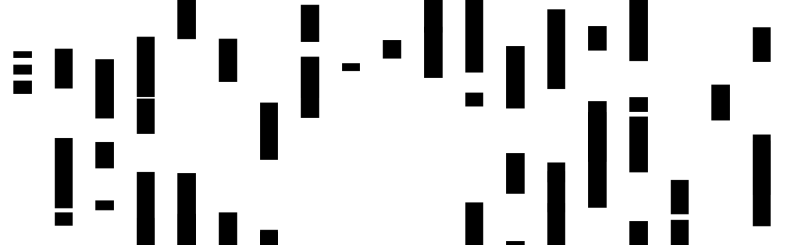
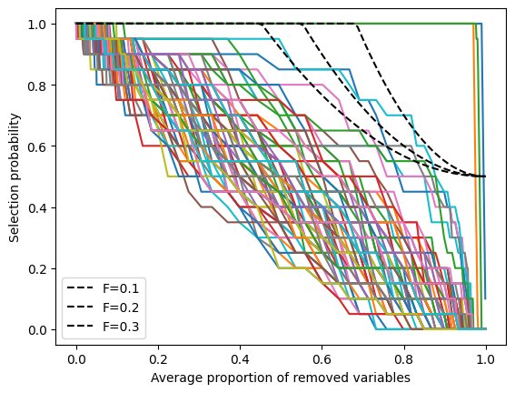

# SpiNet: Sparse Interval-Censored Neural Networks



 Our implementation allows users to effectively explore the relationship between the proportion of selected variables ($q_\lambda/p$) and the selection frequency of each feature $j$ ($\pi^\lambda_j$) with interval-censored targets, while also providing a graphical framework for controlling the expected number of falsely selected variables.

1. Orientative limits for the lambda grid are set based on a preliminary whole path run.
2. For each subsampling draw, a distinct path is created.
3. We iterate through the selection states of all paths at each lambda value. During each iteration:
   - The average selection probability for each variable is calculated across all models.
   - We ensure that the selection probability for each variable is monotonically decreasing as we progress through the lambda values.
   - At each step, we take the element-wise minimum between the current selected and the new average selection probability.
   - The outcome is that the selection probability curves for each variable will be monotonically decreasing across the lambda values.
4. Subsequently, we plot $\pi^{\lambda}_{1}, ..., \pi^{\lambda}_{p}$ against $\frac{q_{\lambda}}{p}$.

	
This approach follows the guidance provided in the original stability selection paper, which states:
 
> To do this, we need knowledge about $q_{\Lambda}$. This can be easily achieved by regularization of the selection procedure $\hat{S}=\hat{S}^q$ in terms of the number of selected variables $q$, i.e., the domain $\Lambda$ for the regularization parameter $\lambda$ determines the number $q$ of selected variables, i.e., $q=q(\Lambda)$. For example, with $l_1$-norm penalization, the number $q$ is given by the variables which enter first in the regularization path when varying from a maximal value $\lambda_{\max }$ to some minimal value $\lambda_{\min }$. Mathematically, $\lambda_{\min }$ is such that $\left|\cup_{\lambda_{\max }\geq \lambda \geq \lambda_{\min } }\hat{S}^\lambda\right| \leq q$.

**Note:**: Recall the bound for the expected number of falsely selected variables under the assumptions in Theorem 1:

$$E(V) \leq\frac{1}{2 \pi_{\mathrm{thr}}-1} \frac{q_{\Lambda}^2}{p}$$

\noindent Dividing both sides by $p$, we obtain

$$\frac{E(V)}{p} \leq \frac{1}{2 \pi_{\mathrm{thr}}-1} \frac{q_{\Lambda}^2}{p^2} =:F\left(\frac{q_{\lambda}}{p}\right)$$
	
 Let us define $x:=\frac{q_{\lambda}}{p}$. Then, for each bound $F$ on the expected proportion of falsely selected variables $\frac{E(V)}{p}$, we derive a family of curves indexed by $F$: 
 
 $$\pi_{thr}(x)=\frac{1}{2}\left(\frac{x^2}{F} + 1\right)$$ 
 
 Finally, we can add these curves to the $\pi^{\lambda}_{1}, \ldots, \pi^{\lambda}_{p}$ against $\frac{q_{\lambda}}{p}$ plot to identify which variables would be selected upon fixing the false discovery rate upper bound $F$ we are willing to accept, see Figure. 
	


## Installation

The code is integrated in [LassoNet](https://github.com/lasso-net/lassonet).

```
pip install lassonet
```

## Usage

See `main.py` for an example of how to run the stability selection algorithm.

## Files

- `generate.py`: Generate the data.
- `main.py`: Run the stability selection algorithm.

## References

Meixide, C. G., Matabuena, M., Abraham, L., & Kosorok, M. R. (2024). Neural interval‐censored survival regression with feature selection. *Statistical Analysis and Data Mining: The ASA Data Science Journal*, 17(4), e11704. [https://doi.org/10.1002/sam.11704](https://doi.org/10.1002/sam.11704)


