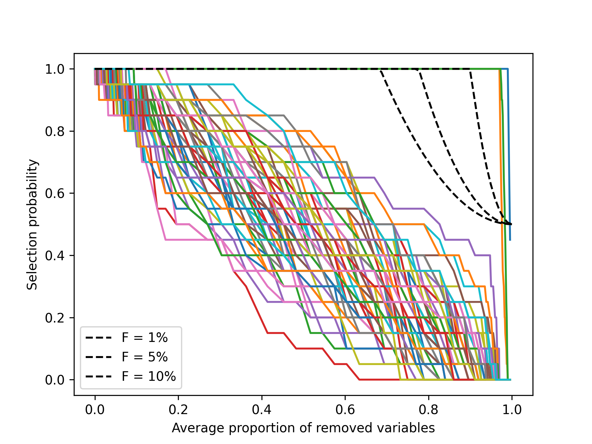

# SpiNet: Sparse Interval-Censored Neural Networks



1. Orientative limits for the lambda grid are set based on a preliminary whole path run.
2. One path is created for each subsampling draw.
3. Average the paths.
4. For each $\frac{q_{\lambda}}{p}$, go backward across the averaged paths and stop at the first $\lambda$ that lets $\frac{q_{\lambda}}{p}$ enter in the model. Register the proportion of times each variable has been selected for that $\lambda$: $\pi^{\lambda}\_{1}, …, \pi^{\lambda}\_{p}$.
5. Plot $\pi^{\lambda}\_{1}, …, \pi^{\lambda}\_{p}$ against $\frac{q_{\lambda}}{p}$.

This follows the indication of the original stability selection paper:

> To do this, we need knowledge about $q_{\Lambda}$. This can be easily achieved by regularization of the selection procedure $\hat{S}=\hat{S}^q$ in terms of the number of selected variables $q$, i.e. the domain $\Lambda$ for the regularization parameter $\lambda$ determines the number $q$ of selected variables, i.e. $q=q(\Lambda)$. For example, with $l_1$-norm penalization as in expressions (2) or (4), the number $q$ is given by the variables which enter first in the regularization path when varying from a maximal value $\lambda_{\max }$ to some minimal value $\lambda_{\min }$. Mathematically, $\lambda_{\min }$ is such that $\left|\cup_{\lambda_{\max }} \geq \lambda \geq \lambda_{\min } \hat{S}^\lambda\right| \leq q$.

**Note:** Recall the bound for the expected number of falsely selected variables under the assumptions in Theorem 1:

$$
E(V) \leq \frac{1}{2 \pi_{\mathrm{thr}}-1} \frac{q_{\Lambda}^2}{p}
$$

We can divide both sides by $p$:

$$
\frac{E(V)}{p} \leq \frac{1}{2 \pi_{\mathrm{thr}}-1} \frac{q_{\Lambda}^2}{p^2}
$$

Say $x := \frac{q_{\lambda}}{p}$. Then for each bound $F$ for the expected proportion of falsely selected variables $\frac{E(V)}{p}$, we have a curve $\frac{1}{2}\left(\frac{x^2}{F} + 1\right)$.

On top of the plot, we could add in dashed black these lines to know which variables would be selected upon fixing what false discovery rate we are willing to pay.


## Installation

The code is integrated in [LassoNet](https://github.com/lasso-net/lassonet).

```
pip install lassonet
```

## Usage

See `main.py` for an example of how to run the stability selection algorithm.

## Files

- `generate.py`: Generate the data.
- `main.py`: Run the stability selection algorithm.

## Reference

TODO
